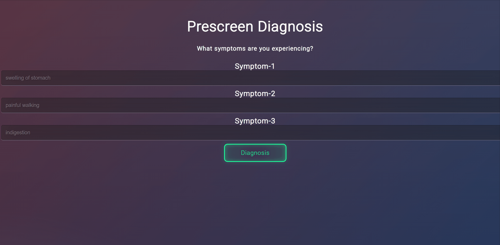

<!-- README START -->
<!-- HEADER -->
# Healthcare Analytics - Prescreening Tool

## About

---

### This project explores the use of machine learning algorithms to predict diseases from symptoms. The dataset used is from Kaggle. 

 

<!--TECH/TOOLS -->

## Technology

---

 
  
  
 
  
  
   
 
 
 <!-- HOW TO RUN APPLICATION LOCALLY -->
  
 
 ## How to Run Web App
 
 ---
- Step 1: Make sure you have Python

- Step 2: Install the requirements: `pip install -r requirements.txt`

- Step 3: Go to this app's directory and run `python app.py`

- Step 4: Visit applications local URL: http://localhost:5000/

---
 
## Data Table (Sample) 
|      |   itching |   skin_rash |   nodal_skin_eruptions |   continuous_sneezing |   shivering |   chills |   joint_pain |   stomach_pain |   acidity |   ulcers_on_tongue |   muscle_wasting |   vomiting |   burning_micturition |   spotting_ urination |   fatigue |   weight_gain |   anxiety |   cold_hands_and_feets |   mood_swings |   weight_loss |   restlessness |   lethargy |   patches_in_throat |   irregular_sugar_level |   cough |   high_fever |   sunken_eyes |   breathlessness |   sweating |   dehydration |   indigestion |   headache |   yellowish_skin |   dark_urine |   nausea |   loss_of_appetite |   pain_behind_the_eyes |   back_pain |   constipation |   abdominal_pain |   diarrhoea |   mild_fever |   yellow_urine |   yellowing_of_eyes |   acute_liver_failure |   fluid_overload |   swelling_of_stomach |   swelled_lymph_nodes |   malaise |   blurred_and_distorted_vision |   phlegm |   throat_irritation |   redness_of_eyes |   sinus_pressure |   runny_nose |   congestion |   chest_pain |   weakness_in_limbs |   fast_heart_rate |   pain_during_bowel_movements |   pain_in_anal_region |   bloody_stool |   irritation_in_anus |   neck_pain |   dizziness |   cramps |   bruising |   obesity |   swollen_legs |   swollen_blood_vessels |   puffy_face_and_eyes |   enlarged_thyroid |   brittle_nails |   swollen_extremeties |   excessive_hunger |   extra_marital_contacts |   drying_and_tingling_lips |   slurred_speech |   knee_pain |   hip_joint_pain |   muscle_weakness |   stiff_neck |   swelling_joints |   movement_stiffness |   spinning_movements |   loss_of_balance |   unsteadiness |   weakness_of_one_body_side |   loss_of_smell |   bladder_discomfort |   foul_smell_of urine |   continuous_feel_of_urine |   passage_of_gases |   internal_itching |   toxic_look_(typhos) |   depression |   irritability |   muscle_pain |   altered_sensorium |   red_spots_over_body |   belly_pain |   abnormal_menstruation |   dischromic _patches |   watering_from_eyes |   increased_appetite |   polyuria |   family_history |   mucoid_sputum |   rusty_sputum |   lack_of_concentration |   visual_disturbances |   receiving_blood_transfusion |   receiving_unsterile_injections |   coma |   stomach_bleeding |   distention_of_abdomen |   history_of_alcohol_consumption |   fluid_overload.1 |   blood_in_sputum |   prominent_veins_on_calf |   palpitations |   painful_walking |   pus_filled_pimples |   blackheads |   scurring |   skin_peeling |   silver_like_dusting |   small_dents_in_nails |   inflammatory_nails |   blister |   red_sore_around_nose |   yellow_crust_ooze | prognosis                               |
|-----:|----------:|------------:|-----------------------:|----------------------:|------------:|---------:|-------------:|---------------:|----------:|-------------------:|-----------------:|-----------:|----------------------:|----------------------:|----------:|--------------:|----------:|-----------------------:|--------------:|--------------:|---------------:|-----------:|--------------------:|------------------------:|--------:|-------------:|--------------:|-----------------:|-----------:|--------------:|--------------:|-----------:|-----------------:|-------------:|---------:|-------------------:|-----------------------:|------------:|---------------:|-----------------:|------------:|-------------:|---------------:|--------------------:|----------------------:|-----------------:|----------------------:|----------------------:|----------:|-------------------------------:|---------:|--------------------:|------------------:|-----------------:|-------------:|-------------:|-------------:|--------------------:|------------------:|------------------------------:|----------------------:|---------------:|---------------------:|------------:|------------:|---------:|-----------:|----------:|---------------:|------------------------:|----------------------:|-------------------:|----------------:|----------------------:|-------------------:|-------------------------:|---------------------------:|-----------------:|------------:|-----------------:|------------------:|-------------:|------------------:|---------------------:|---------------------:|------------------:|---------------:|----------------------------:|----------------:|---------------------:|----------------------:|---------------------------:|-------------------:|-------------------:|----------------------:|-------------:|---------------:|--------------:|--------------------:|----------------------:|-------------:|------------------------:|----------------------:|---------------------:|---------------------:|-----------:|-----------------:|----------------:|---------------:|------------------------:|----------------------:|------------------------------:|---------------------------------:|-------:|-------------------:|------------------------:|---------------------------------:|-------------------:|------------------:|--------------------------:|---------------:|------------------:|---------------------:|-------------:|-----------:|---------------:|----------------------:|-----------------------:|---------------------:|----------:|-----------------------:|--------------------:|:----------------------------------------|
|    0 |         1 |           1 |                      1 |                     0 |           0 |        0 |            0 |              0 |         0 |                  0 |                0 |          0 |                     0 |                     0 |         0 |             0 |         0 |                      0 |             0 |             0 |              0 |          0 |                   0 |                       0 |       0 |            0 |             0 |                0 |          0 |             0 |             0 |          0 |                0 |            0 |        0 |                  0 |                      0 |           0 |              0 |                0 |           0 |            0 |              0 |                   0 |                     0 |                0 |                     0 |                     0 |         0 |                              0 |        0 |                   0 |                 0 |                0 |            0 |            0 |            0 |                   0 |                 0 |                             0 |                     0 |              0 |                    0 |           0 |           0 |        0 |          0 |         0 |              0 |                       0 |                     0 |                  0 |               0 |                     0 |                  0 |                        0 |                          0 |                0 |           0 |                0 |                 0 |            0 |                 0 |                    0 |                    0 |                 0 |              0 |                           0 |               0 |                    0 |                     0 |                          0 |                  0 |                  0 |                     0 |            0 |              0 |             0 |                   0 |                     0 |            0 |                       0 |                     1 |                    0 |                    0 |          0 |                0 |               0 |              0 |                       0 |                     0 |                             0 |                                0 |      0 |                  0 |                       0 |                                0 |                  0 |                 0 |                         0 |              0 |                 0 |                    0 |            0 |          0 |              0 |                     0 |                      0 |                    0 |         0 |                      0 |                   0 | Fungal infection                        |
|    1 |         0 |           1 |                      1 |                     0 |           0 |        0 |            0 |              0 |         0 |                  0 |                0 |          0 |                     0 |                     0 |         0 |             0 |         0 |                      0 |             0 |             0 |              0 |          0 |                   0 |                       0 |       0 |            0 |             0 |                0 |          0 |             0 |             0 |          0 |                0 |            0 |        0 |                  0 |                      0 |           0 |              0 |                0 |           0 |            0 |              0 |                   0 |                     0 |                0 |                     0 |                     0 |         0 |                              0 |        0 |                   0 |                 0 |                0 |            0 |            0 |            0 |                   0 |                 0 |                             0 |                     0 |              0 |                    0 |           0 |           0 |        0 |          0 |         0 |              0 |                       0 |                     0 |                  0 |               0 |                     0 |                  0 |                        0 |                          0 |                0 |           0 |                0 |                 0 |            0 |                 0 |                    0 |                    0 |                 0 |              0 |                           0 |               0 |                    0 |                     0 |                          0 |                  0 |                  0 |                     0 |            0 |              0 |             0 |                   0 |                     0 |            0 |                       0 |                     1 |                    0 |                    0 |          0 |                0 |               0 |              0 |                       0 |                     0 |                             0 |                                0 |      0 |                  0 |                       0 |                                0 |                  0 |                 0 |                         0 |              0 |                 0 |                    0 |            0 |          0 |              0 |                     0 |                      0 |                    0 |      
  
  
  
  
  
  
  
  

